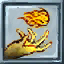

# Fireball

| Alan               | Değer    |
| ------------------ | -------- |
| **Adı**            | Fireball |
| **Sözü**           | Vas Flam |
| **Reagents**       |          |
| **Duration**       |          |
| **Cast Time**      | 1.5      |
| **Freeze Time**    |          |
| **Gereken Mana**   | 9        |
| **Gereken Magery** | 10.0     |
