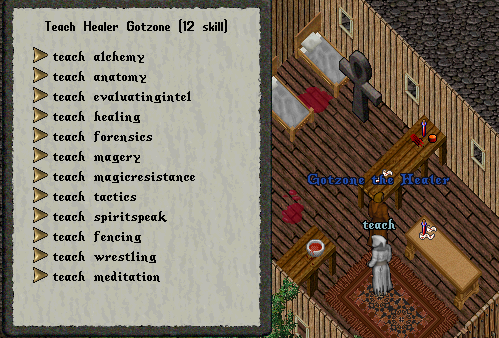
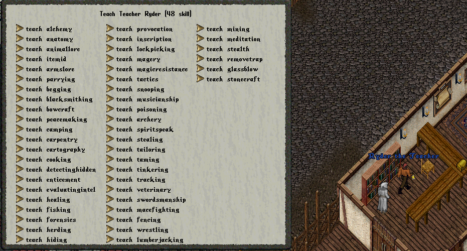

---
layout:
  width: wide
  title:
    visible: true
  description:
    visible: true
  tableOfContents:
    visible: true
  outline:
    visible: true
  pagination:
    visible: true
  metadata:
    visible: true
  tags:
    visible: true
---

# Teaching

_**Teach**_ işlemleri eski usül vendorlardan yapılmaktadır. Teach yapacağınız becerinin seviyesi tamamen o vendorun o becerisinin seviyesi ile alakalıdır. Örneğin

Alchemy teachletmek istiyorsunuz ve Alchemist vendoruna gidip Teach Alchemy yazdınız. Vendor sizden belirli bir ücret ister örneğin 166 gp, Bu miktar aynı zamanda o vendorun size öğretebileceği beceri seviyesidir. 166 gp vendorun üzerine bıraktığınızda Alchemy becerinizi 16.6 oranında öğrenmiş olacaksınız.

<figure><figcaption>
Direkt Teach
</figcaption></figure>

<figure><figcaption>
Teach Bilgi ekranı
</figcaption></figure>

#### Teacher

Ayrıca şehirlerde bulunan Teacher vendorlarından tüm becerileri teach yapabilirsiniz. Bu vendorlar da direkt olarak 30.0 sabit bir oranda beceri öğretme zorunluluğu _<mark style="color:red;">**YOKTUR**</mark>_. Bu vendorlarda da beceri seviyeleri değişkenlik göstermektedir. Teacher vendorunun tek amacı sadece tüm becerileri bir arada toplamaktır.

<figure><figcaption></figcaption></figure>
