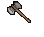

---
layout:
  width: wide
  title:
    visible: true
  description:
    visible: true
  tableOfContents:
    visible: true
  outline:
    visible: true
  pagination:
    visible: true
  metadata:
    visible: true
  tags:
    visible: true
---

# Axe

<table><thead><tr><th width="134">Görsel</th><th width="163">Adı</th><th width="159">Skill</th><th width="96">Ağırlık</th><th width="92">Fiyat</th><th>Üretim</th><th>Min. Str</th><th>Çift El</th><th>Range</th></tr></thead><tbody><tr><td></td><td>Large Battle Axe</td><td>Swordsmanship</td><td>8.0 kg</td><td>138 gp</td><td>20 Iron Ingot</td><td>45</td><td>Evet</td><td>0-1</td></tr><tr><td></td><td>Double Axe</td><td>Swordsmanship</td><td>8.0 kg</td><td>124 gp</td><td>12 Iron Ingot</td><td>45</td><td>Evet</td><td>0-1</td></tr><tr><td></td><td>Axe</td><td>Swordsmanship</td><td>7.0 kg</td><td>147 gp</td><td>14 Iron Ingot</td><td>35</td><td>Evet</td><td>0-1</td></tr><tr><td></td><td>Battle Axe</td><td>Swordsmanship</td><td>8.0 kg</td><td>141 gp</td><td>14 Iron Ingot</td><td>40</td><td>Evet</td><td>0-1</td></tr><tr><td></td><td>Executioner's Axe</td><td>Swordsmanship</td><td>7.0 kg</td><td>163 gp</td><td>16 Iron Ingot</td><td>35</td><td>Evet</td><td>0-1</td></tr><tr><td></td><td>Two Handed Axe</td><td>Swordsmanship</td><td>10.0 kg</td><td>161 gp</td><td>16 Iron Ingot</td><td>40</td><td>Evet</td><td>0-1</td></tr><tr><td></td><td>War Axe</td><td>Macefighting</td><td>6.0 kg</td><td>171 gp</td><td>16 Iron Ingot</td><td>35</td><td>Hayır</td><td>0-1</td></tr></tbody></table>
