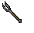
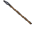

---
layout:
  width: wide
  title:
    visible: true
  description:
    visible: true
  tableOfContents:
    visible: true
  outline:
    visible: true
  pagination:
    visible: true
  metadata:
    visible: true
  tags:
    visible: true
---

# Fence

<table><thead><tr><th width="141">Görsel</th><th>Adı</th><th>Skill</th><th width="96">Ağırlık</th><th width="99">Fiyat</th><th>Üretim</th><th>Min. Str</th><th>Çift El</th><th>Range</th><th data-type="image"></th></tr></thead><tbody><tr><td></td><td>Pitchfork</td><td>Fencing</td><td>8.0 kg</td><td>48 gp</td><td>5 Iron Ingot</td><td>15</td><td>Evet</td><td>0-1</td><td></td></tr><tr><td></td><td>Warfork</td><td>Fencing</td><td>6.0 kg</td><td>78 gp</td><td>12 Iron Ingot</td><td>35</td><td>Hayır</td><td>0-1</td><td></td></tr><tr><td></td><td>Short Spear</td><td>Fencing</td><td>4.0 kg</td><td>100 gp</td><td>6 Iron Ingot</td><td>15</td><td>Evet</td><td>0-1</td><td></td></tr><tr><td></td><td>Kryss</td><td>Fencing</td><td>4.2 kg</td><td>103 gp</td><td>8 Iron Ingot</td><td>10</td><td>Hayır</td><td>0-1</td><td></td></tr><tr><td></td><td>Spear</td><td>Fencing</td><td>6.5 kg</td><td>154 gp</td><td>12 Iron Ingot</td><td>30</td><td>Evet</td><td>0-1</td><td></td></tr></tbody></table>

