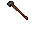
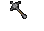
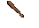
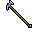
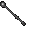

---
layout:
  width: wide
  title:
    visible: true
  description:
    visible: true
  tableOfContents:
    visible: true
  outline:
    visible: true
  pagination:
    visible: true
  metadata:
    visible: true
  tags:
    visible: true
---

# Mace

<table><thead><tr><th width="99">Görsel</th><th width="135">Adı</th><th>Skill</th><th width="97">Ağırlık</th><th width="93">Fiyat</th><th>Üretim</th><th>Min. Str</th><th>Çift El</th><th>Range</th></tr></thead><tbody><tr><td></td><td>War Hammer</td><td>Macefighting</td><td>10.0 kg</td><td>163 gp</td><td>16 Iron Ingot</td><td>40</td><td>Evet</td><td>0-1</td></tr><tr><td></td><td>Warmace</td><td>Macefighting</td><td>8.0 kg</td><td>138 gp</td><td>14 Iron Ingot</td><td>30</td><td>Hayır</td><td>0-1</td></tr><tr><td></td><td>Club</td><td>Macefighting</td><td>7.5 kg</td><td>16 gp</td><td>4 Log</td><td>10</td><td>Hayır</td><td>0-1</td></tr><tr><td></td><td>Hammerpick</td><td>Macefighting</td><td>10.0 kg</td><td>87 gp</td><td>8 Iron Ingot, 1 Log </td><td>35</td><td>Hayır</td><td>0-1</td></tr><tr><td></td><td>Maul</td><td>Macefighting</td><td>10.0 kg</td><td>98 gp</td><td>10 Iron Ingot</td><td>20</td><td>Hayır</td><td>0-1</td></tr><tr><td></td><td>Mace</td><td>Macefighting</td><td>10.0 kg</td><td>64 gp</td><td>6 Iron Ingot</td><td>20</td><td>Hayır</td><td>0-1</td></tr></tbody></table>
