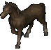

---
layout:
  width: wide
  title:
    visible: true
  description:
    visible: true
  tableOfContents:
    visible: true
  outline:
    visible: true
  pagination:
    visible: true
  metadata:
    visible: true
  tags:
    visible: true
---

# Horse



<figure><figcaption>
Horse (Tan)
</figcaption></figure>



<figure><figcaption>
Horse (Gray)
</figcaption></figure>



<figure><figcaption>
Horse (Light Brown)
</figcaption></figure>



<figure><figcaption>
Horse (Dark Brown)
</figcaption></figure>



| Stat    | Min. Değer | Max. Değer |
| ------- | ---------- | ---------- |
| **STR** | 44         | 120        |
| **DEX** | 36         | 55         |
| **INT** | 6          | 10         |

## Horse (Tan)

| ARMOR  | 5 | 5 |
| ------ | - | - |
| DAMAGE | 2 | 5 |

## Horse (Gray)

| ARMOR  | 5 | 5 |
| ------ | - | - |
| DAMAGE | 3 | 6 |

## Horse (Light Brown)

| ARMOR  | 6 | 6 |
| ------ | - | - |
| DAMAGE | 4 | 7 |

## Horse (Dark Brown)

| ARMOR  | 8 | 8 |
| ------ | - | - |
| DAMAGE | 4 | 7 |
